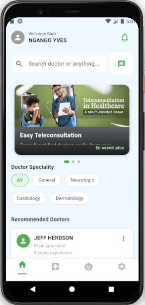
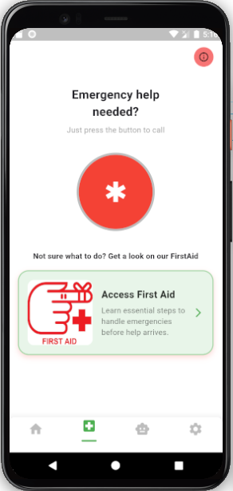
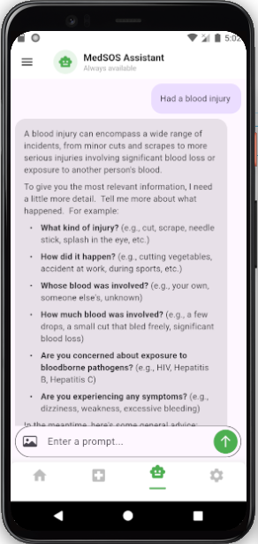
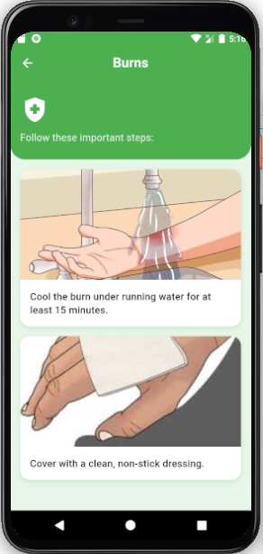
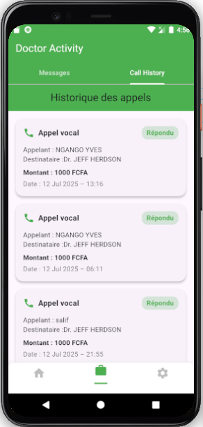
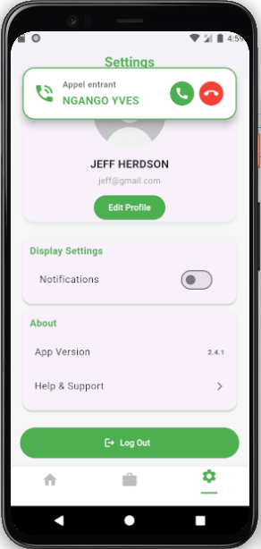
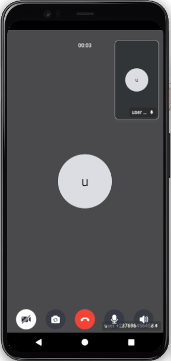
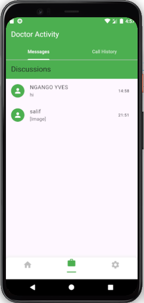

# 📱 MedSOS

A **teleconsultation and medical emergency support app** designed to improve **healthcare accessibility in Cameroon**.  
Built with **Flutter**, powered by **Firebase/Firestore** for real-time communication, and **ZEGOCLOUD** for seamless video/audio calls.  

---

## 🌍 About the Project
MedSOS enables patients and doctors to connect remotely, ensuring **accessible, reliable, and secure healthcare**.  

Key features:
- 👨‍⚕️ **Remote consultations** via audio & video calls  
- ⭐ **Doctor ratings & reviews** after sessions  
- 📅 **Appointment scheduling & management**  
- 💳 **Secure payments & subscriptions**  
- 🔐 **Role-based platform** (patients & doctors)  

---

## 🖼️ Screenshots

<p align="center">
  
  
  
  
</p>

<p align="center">
  
  
  
  
</p>

---

## ⚙️ Tech Stack

- **Frontend**: Flutter (Dart)  
- **Backend**: Firebase Authentication, Firestore Database, Cloud Functions  
- **Video/Audio Calls**: ZEGOCLOUD SDK  
- **Payments**: Mobile Money (MTN, Orange, AfrikPay, etc.)  

---
## 📩 Acquire this Project

The **full source code of MedSOS** is private and not publicly available.  
If you are interested in acquiring or collaborating on this project, please contact:

- 📧 Email: yveslucas20@gmail.com 
- 💼 LinkedIn: [NGANGO YVES](https://www.linkedin.com/in/ngango-yves-636209300/)  
- 🌐 Portfolio: [Full Stack](https://ngangoyves.github.io/Fullstack-Portfolio/)  

Only serious inquiries will be considered.
---
## 🚀 Getting Started

### 1. Clone the repository
```bash
git clone https://github.com/ton-compte/medsos.git
cd medsos


